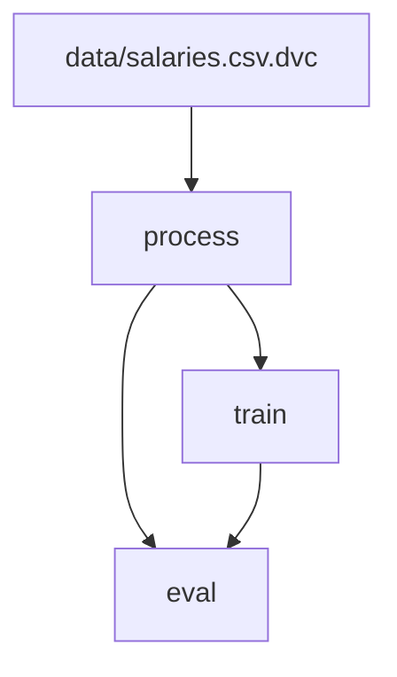
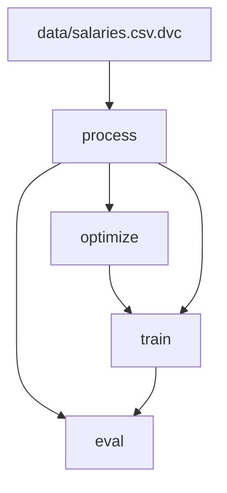

```mermaid
flowchart TD
	node1["data/salaries.csv.dvc"]
	node2["eval"]
	node3["process"]
	node4["train"]
	node1-->node3
	node3-->node2
	node3-->node4
	node4-->node2
```

```mermaid
flowchart TD
	node1["data/salaries.csv.dvc"]
	node2["eval"]
	node3["optimize"]
	node4["process"]
	node5["train"]
	node1-->node4
	node3-->node5
	node4-->node2
	node4-->node3
	node4-->node5
	node5-->node2
```
